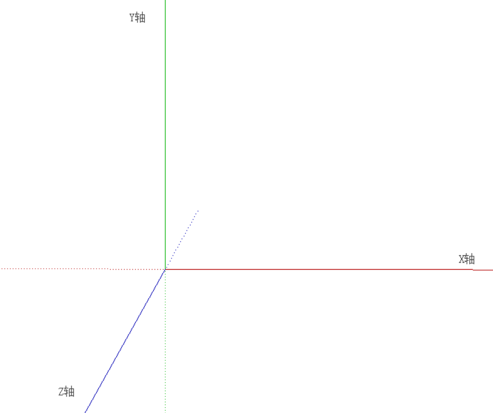
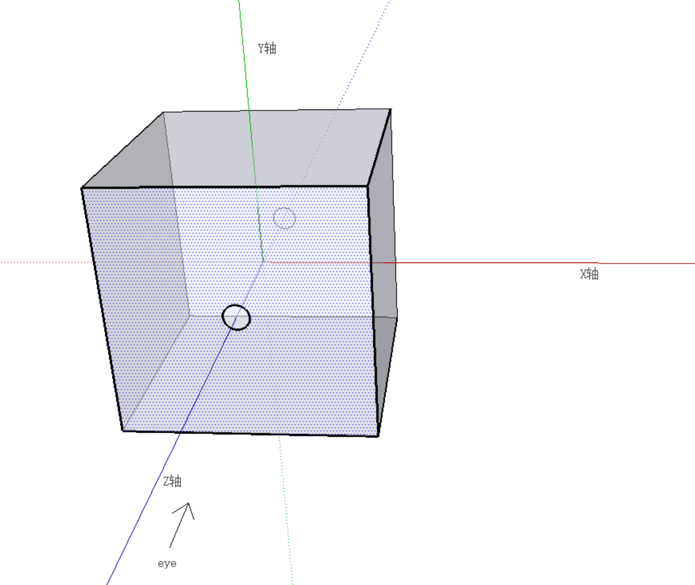
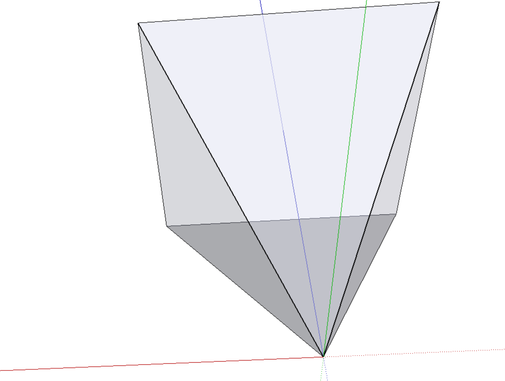
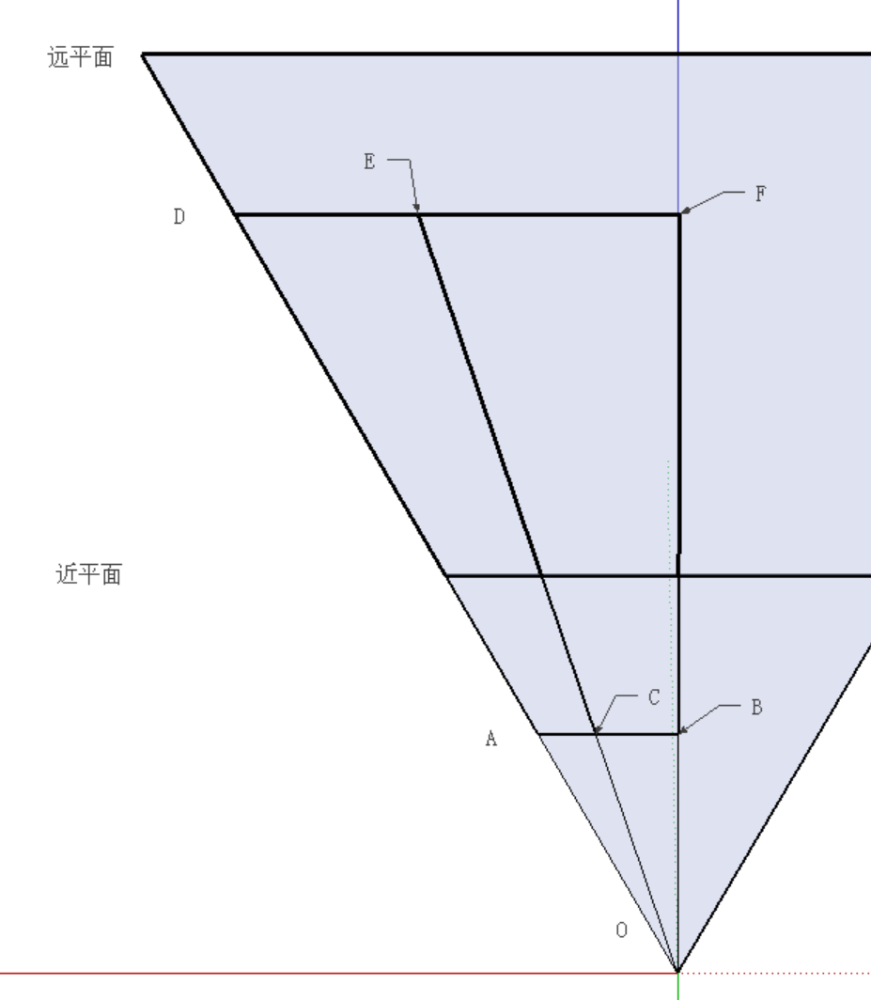

---
---
###17-3-19更新gluPerspective部分
---
大家都知道`gluLookAt`和`gluPerspective`函数分别对应对模型的`model、view、perspective`三种变换的`view`和`perspective`变换。而其内部实现都是一个4x4矩阵，而函数参数影响矩阵内的数值。下面我们来简单讨论一下这两个矩阵的推导，和它们做了哪些工作。

---

首先，说一点预备知识。大家都知道OpenGL的坐标系是右手坐标系。如果按照平常习惯放置x轴和y轴的话(x轴正方向从左至右，y轴正方向从下至上)，z轴正方向则为从前向后，即人眼睛看向x轴负方向，如图：

其中红、绿、蓝(rgb)色实线分别代表x、y、z轴正方向，而虚线代表负方向。我们往OpenGL里面输入的点坐标就是在这个坐标系下了。

让我们稍微回顾一下渲染流程。首先顶点着色器对输入的顶点属性进行计算，往往是计算以得到矩阵变换后的顶点的新坐标。如果是实时渲染的话，很可能光照也是在这一阶段计算的(黑暗之魂3作为16年的3A游戏，光照结果也是插值得到的)。然后是组装图元、剪裁、光栅化、片元着色、测试、混合。

注意剪裁这一步。图元组装完成之后，并不是所有的图元都会被光栅化并参与到片元着色，而是在一定范围内的图元才可以。而如果一个图元部分在范围内，部分在范围外，还会被沿着范围边界分割，生成完全在范围内的新的图元，来参加后续计算。

那么怎么界定这个范围呢？

这个范围其实就是一个以原点为中心，边长为2的正方体。正方体内的点(就是该点x、y、z坐标分别都在-1~1以内)，就会被光栅化，参与到片元计算。如图所示。

图中两个圆形代表z轴与正方体平面的交点，为了方便读者理解，没有其他意思。

这个正方体围成的空间，叫做**剪裁空间**。

大家还记得人眼看向的方向是z轴负方向吗？请注意图中有阴影的平面。正方体内的模型，经过光栅化后形成片元，最后在这个平面上的投影，也就是要输出到平面上的图像了(当然得到这个投影还要很多步骤，但大体可以这么理解)。

---

下面我们来看一下啊`gluLookAt`这个函数。

首先看它的函数原型
```c++
void gluLookAt(GLdouble eyeX, GLdouble eyeY, GLdouble eyeZ, GLdouble centerX, GLdouble centerY, GLdouble centerX, GLdouble upX, GLdouble upY, GLdouble upZ);
```
这个函数的参数很好理解：虽然有9个参数，但明显每3个参数组成一个向量，代表了一个三维空间中的点，或者一个向量(`eye`和`center`是点，`up`是一个向量)。那么我们要做的也很好理解：在`eye`这个位置以`up`为上，看向`center`(也就是z轴负方向为`eye`->`center`)构建新的坐标系。

既然要构造一个新坐标系，那么肯定要构造一个矩阵。而新坐标系以`eye`为原点，那么往往还要做平移。

大家知道，在三维空间中，旋转和重建坐标系没什么本质不同，那我们就现在构造这个旋转矩阵。

首先确定z轴。因为OpenGL中镜头总是看向z轴负方向，所以z轴为：
```c++
vec axisZ = center - eye;
axisZ.normalize();
```
新坐标系的y轴当然和给定的参数`up`有关，但不一定会和`up`共线或者平行。首先，给定的`up`向量不能和我们刚才求出的z轴平行([The UP vector must not be parallel to the line of sight from the eye point to the reference point.](https://www.khronos.org/registry/OpenGL-Refpages/gl2.1/xhtml/gluLookAt.xml))。那么，`up`向量就和z轴能唯一确定一个平面。那么y轴就是这平面上和z轴垂直的一个单位向量(当然，y轴和`up`夹角要小于90°)。y轴的求法：
```c++
vec axisY = up - dot(up, axisZ); // 就是up向量减去其z轴分量，然后归一化
axisY.normalize();
```
知道了y轴和z轴，那么x轴自然也能求了：
```c++
vec axisX = cross(axisY, axisZ); // 注意参数不能写反，叉乘的乘数不可交换。
axisX.normalize(); // 其实y轴z轴都是单位向量，不归一化也可以。
```
这样我们得到了新坐标系的3个基。

当然`gluLookAt`的实际实现是一个更巧妙一点的方法。

当我们知道z轴和`up`之后，我们可以先求x轴：
```c++
vec axisX = cross(up, axisZ);
axisX.normalize();
```
然后再求y轴：
```c++
vec axisY = cross(axisZ, axisX);
axisY.normalize() // 其实z轴y轴都是单位向量，不归一化也可以
```
知道了新坐标系的三个基之后，我们就可以构建这个旋转矩阵了。

$$
 \begin{matrix}
 axisX.x & axisX.y & axisX.z \\
 axisY.x & axisY.y & axisY.z \\
 axisZ.x & axisZ.y & axisZ.z
 \end{matrix}
$$

矩阵如上。但是光有矩阵还不够。想要做到在`eye`点观察目标的效果，还要将坐标原点移动到`eye`的位置。当然，相同的操作我们也可以解释为"坐标系中物体朝相反方向移动"。

线性变换是没法做移动的。因此我们要做一个4x4的仿射变换矩阵。

那么很容易理解，我们这个做移动的仿射变换矩阵如下：

$$
\begin{matrix}
1 & 0 & 0 & -eyeX \\
0 & 1 & 0 & -eyeY \\
0 & 0 & 1 & -eyeZ \\
0 & 0 & 0 & 1
\end{matrix}
$$

我们当然希望做一次矩阵运算就解决了旋转和位移的问题。因此要合并矩阵。那么我们需要先将旋转矩阵也处理成1个4x4的仿射变换矩阵。如下：

$$
\begin{matrix}
axisX.x & axisX.y & axisX.z & 0 \\
axisY.x & axisY.y & axisY.z & 0 \\
axisZ.x & axisZ.y & axisZ.z & 0 \\
0 & 0 & 0 & 1
\end{matrix}
$$

我们现在要做的事就是合并这两个矩阵。那么问题来了：
我们是先做平移还是先做旋转呢？
---
答案是先做平移。

道理很简单：我们现在的平移矩阵做的平移运动，是用现有坐标系下的基来衡量的。

如果先做旋转的话，我们再做平移运动，就是用新坐标系的基来做运动了。

打个比方来说：

我们俩游泳池的长度是50，单位是米。如果我们改变了测量的基，变成尺的话，再引用50这个数据就不对了。要想获得正确的游泳池长度，就需要用50这个数据，乘以从米到尺的转换矩阵(假设这个转换是用矩阵来做的的话。。)。

回到我们`gluLookAt`函数推导的内容。如果你想先做旋转，再做正确的平移的话，需要将平移矩阵也乘以旋转矩阵以得到新坐标系下的平移矩阵。但仔细想想的话，这种方式与先平移，再旋转没有本质区别。

因此我们最后得到的`gluLookAt`的旋转矩阵就是

$$
\begin{matrix}
axisX.x & axisX.y & axisX.z & axisX*eye \\
axisY.x & axisY.y & axisY.z & axisY*eye \\
axisZ.x & axisZ.y & axisZ.z & axisZ*eye \\
0 & 0 & 0 & 1
\end{matrix}
$$

---

上文说了`gluLookAt`的推导过程，下面我们来推导`gluPerspective`函数。

我们先来说一下这个函数是干什么的。`perspective`的意思是`透视`，也就是说这个函数是用来做`透视投影`的。与`透视投影`相对应的还有`正交投影`。都是将三维物体投影到二维，这两种投影有什么区别呢？
比方说我们的相机拍出来的照片，就可以看作是`透视投影`。因为照片里的物体**近大远小**。给铁轨拍张照，你会发现照片中的铁轨会在远处相交。
而制图中物体的三视图，都是`正交投影`。如果你做一份铁轨的俯视图，图中的铁轨就永远不会相交。
这个概念大家应该都知道，我也就简单说一下。。

那么我们来说一下这个函数干了什么。**它将某一块区域中的物体投影到了剪裁空间**。就这么简单。

那要投影的那块区域又是怎么确定的呢？

首先，要计算最终`剪裁空间`中的模型数据，就要等到`fragment shader`阶段了。而且这时候操作的也不再是顶点数据，而是光栅化后得到的大量片元数据，所以一般不在这个阶段进行变换操作。还记得`透视投影`**近大远小** 吗？我们在`透视投影`这一阶段就要实现这一效果。当然这也是这个运算叫`透视投影`的原因。

说到近大远小，我们往往会想象出一`四棱锥体`。



如图所示，这种四棱锥体，在接近眼睛的位置，即使很小的物体也能遮住整个视野，这点和我们人眼的视野原理很像。但是，我们的计算机系统最终会把物体投影到屏幕上。如果你不是刻意去模拟一个眼睛的话，通常情况下不会被小物体遮蔽视野。所以我们要投影的区域其实是这样的：


相当于一个大四棱锥去掉一个小四棱锥。这种结构一般被称为`平截头体`或者`视锥`(Frustums)。

这个`平截头体`的近平面即会被投影到`剪裁空间`z值为-1的平面，而其远平面会被投影到z值为1的平面。

关于其投影的运算，我们后面再说，先看这个`平截头体`的范围是怎么确定的。


如图所示，我们可以由4个参数来确定这个`平截头体`的大小，分别是`角a`、`角b`、`近平面z坐标`、`远平面z坐标`。

然后我们来看`gluPerspective`函数的函数原型：

```c++
gluPerspective(GLdouble fovy, GLdouble aspect, GLdouble znear, GLdouble zfar);
```

果然一一对应，要4个参数！
不过前两个参数略有区别：
`fovy`意思是`field of view y`，也就是y轴上的视野，是2倍的`角a`。
`aspect`代表着**纵横比**，也就是**y/x**。注意别弄反了。那么`角b`的值就是`角a`/`aspect`。
`znear`、`zfar`则分别代表了`近平面z坐标`、`远平面z坐标`。

下面我们来看`平截头体`的俯视图。



我们假设`AB`长为1，`E`是`平截头体`中的一点。因为`平截头体`中的点最终要映射到`剪裁空间`中，因此我们可以把点`C`看作是`E`最终在剪裁空间中投影平面的相对位置。
而根据三角形相似，我们知道`E.x`/`E.z` = `BC`/`OB`。

`OB`的值是多少呢？由图可知，`OB`/`AB` = `cot(fovx/2)`，`fovx` = `fovy`/`aspect`，由此可知，这里`OB`的值是一个常数，我们不妨设为`d`。那么`C.x`的值当为`E.x`/`E.z`\*`d`。同理可得`C.y`得值为`E.y`/`E.z`\*`d`。点`E`最终在屏幕上得投影位置跟它的z坐标成反比。那么构建怎样的矩阵才能使转换后的x、y坐标与z坐标成反比呢？线性变换矩阵是做不到这点的。因此我们还是要构建一个4x4的仿射变换矩阵，如下：

$$
\begin{matrix}
1/aspect & 0 & 0   & 0 \\
0        & 1 & 0   & 0 \\
0        & 0 & 1   & 0 \\
0        & 0 & 1/d & 0
\end{matrix}
$$

一个向量`v`乘此矩阵后得到向量`v'`\[ x/aspect, y, z, z/d \]，归一化处理后等于向量\[ x*d/(aspect * z), y*d/z, d, 1 \]。

因为`透视投影`之后的计算依然要用到物体的深度信息，因此我们不能只映射物体的x、y坐标，z坐标也要映射到`剪裁空间`中(否则可以看成物体被映射到了一个平面上，丢失了深度信息)。

那很自然地，我们要把`近平面`映射到-1的位置，`远平面`映射到1的位置。很明显，这种映射光靠线性映射是实现不了的，因此我们要加位移，做一个仿射变换。因为要映射的只有z坐标(x、y坐标的映射前面已经算出来了)，因此这次我们不需要构建矩阵，用一个2元1次方程组就够了。注意我们现在的矩阵处理过的齐次向量，其第4位(不妨叫w)的值为`z/d`。
```c++
d * (A * znear + B)/znear == -1;
d * (A * zfar + B)/zfar == 1;
A == (zfar + znear)/(d*(zfar - znear));
B == 2*zfar*znear/(d*(zfar - znear));
```
那么点`E`会被映射到`(2*E.z/(zfar - znear) + 2*zfar*znear/(d*(zfar - znear)))/E.z`的位置。这个公式太长，我们还是用`A`、`B`来代替。那么`E`被映射到`d*A + d*B/E.z`的位置。观察这个坐标，其中唯一变量是`E.z`，那么这个式子的值就是一个自变量为`E.z`的反函数，也就是说，物体的z坐标到`剪裁空间`内的映射不是线性映射。

为什么会这样？我们不是用矩阵进行运算的吗？怎么会不是线性映射？其实是因为我们用的坐标是齐次坐标。如果这个矩阵和要处理的向量都代表这4维空间中的点，那么这些变换依然是线性的。当我们实际上是用它来表示3维空间中的点。

如果将齐次向量看为4维向量，那么w的值就代表此点在第4维(我们观察不到的)上投影的位置，此值自然影响不到三维空间。但如果是齐次向量，我们就需要将向量的x、y、z分量分别除以w分量，那么w的值自然就会影响此点在三维空间的位置。以上式为例。本来我们z坐标到`剪裁空间`中坐标z'的映射式为`z' = A*z + B;`，但因为我们变换矩阵的第4行第3列值为`1/d`，导致我们得到的齐次向量w的值为`z/d`，其z坐标的值也就变为了`z' = d*A + d*B/z`，从线性映射变为了非线性。好在映射虽然不是线性的，但还是单调的，物体的深度顺序没变。

关于透视投影还有最后一个问题要讲。看上式我们的映射，是将`近平面`映射到了-1，`远平面`映射到了1。但OpenGL中我们的视线方向是z轴负方向，也就是说看的是1这个平面，最后映射到屏幕上的平面是远平面！OpenGL实现中解决这个问题的方法，是将矩阵第4行第3列的值乘-1，也就是`1/d -> -1/d`。但是这样计算当然使得x、y值的映射也乘了-1，但其实现就是这样的。

另外还有一个小技巧。我们知道计算机做除法比做乘法麻烦得多，因此在`透视投影`矩阵中我们不使第4行第3列的值为`-1/d`而是`-1`，然后将矩阵中其他所有值乘`d`。所以我们最后得到的矩阵如下：

$$
\begin{matrix}
d/aspect & 0 & 0                         & 0 \\
0        & d & 0                         & 0 \\
0        & 0 & (zfar+znear)/(zfar-znear) & 2*zfar*znear/(zfar-znear) \\
0        & 0 & -1                        & 0
\end{matrix}
$$

以上就是`gluLookAt`和`gluPerspective`两个函数的完整推导。
